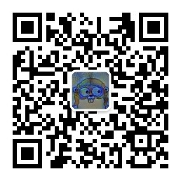

# IoT-Firstep
一个物联网(IoT)开发的入门教程。涉及单片机、上位机、移动应用、服务器后台开发的知识。以及蓝牙4.0、以太网模块的使用实例。
## 状态
努力编写中，还未进行核查。。。
## 说明
本文的开发环境都是在Windows平台进行的。关于iOS相关的开发暂时没有编写，后续可能会添加，章节编号4.x暂时空出来。

## 内容介绍
- [前言](https://github.com/nladuo/IoT-Firstep/blob/master/book/preface.md)  

### 第一部分：基础入门
- 第1部分：[单片机开发——Arduino](https://github.com/nladuo/IoT-Firstep/blob/master/book/1.0.md)  
        - 1.1 [Arduino开发环境搭建](https://github.com/nladuo/IoT-Firstep/blob/master/book/1.1.md)  
        - 1.2 [点亮一个Led](https://github.com/nladuo/IoT-Firstep/blob/master/book/1.2.md)  
        - 1.3 [PWM操作](https://github.com/nladuo/IoT-Firstep/blob/master/book/1.3.md)  
        - 1.4 [UART的使用](https://github.com/nladuo/IoT-Firstep/blob/master/book/1.4.md)  
- 第2部分：[上位机开发——.Net](https://github.com/nladuo/IoT-Firstep/blob/master/book/2.0.md)  
        - 2.1 [winform快速入门](https://github.com/nladuo/IoT-Firstep/blob/master/book/2.1.md)  
        - 2.2 [serialport控件使用](https://github.com/nladuo/IoT-Firstep/blob/master/book/2.2.md)  
- 第3部分：[移动开发——Android](https://github.com/nladuo/IoT-Firstep/blob/master/book/3.0.md)  
        - 3.1 [安卓开发环境搭建](https://github.com/nladuo/IoT-Firstep/blob/master/book/3.1.md)  
        - 3.2 [HelloActivity分析](https://github.com/nladuo/IoT-Firstep/blob/master/book/3.2.md)  
        - 3.3 [LinearLayout与基本控件](https://github.com/nladuo/IoT-Firstep/blob/master/book/3.3.md)  
        - 3.4 [Intent与Activity的生命周期](https://github.com/nladuo/IoT-Firstep/blob/master/book/3.4.md)  
        - 3.5 [ListView与BaseAdapter](https://github.com/nladuo/IoT-Firstep/blob/master/book/3.5.md)  
        - 3.6 [Service学习](https://github.com/nladuo/IoT-Firstep/blob/master/book/3.6.md)  
        - 3.7 [Android6.0权限机制]  
        - 3.8 [BroadCastReciever学习]  
- 第4部分：[后端开发——Golang](https://github.com/nladuo/IoT-Firstep/blob/master/book/5.0.md)  
        - 4.1 [go语言开发环境搭建](https://github.com/nladuo/IoT-Firstep/blob/master/book/5.1.md)  
        - 4.2 [go语言基础快速入门](https://github.com/nladuo/IoT-Firstep/blob/master/book/5.2.md)  
        - 4.3 [用go语言显示一个网页](https://github.com/nladuo/IoT-Firstep/blob/master/book/5.3.md)  
        - 4.4 [go语言web框架——gin](https://github.com/nladuo/IoT-Firstep/blob/master/book/5.4.md)  
        - 4.5 [部署go语言项目](https://github.com/nladuo/IoT-Firstep/blob/master/book/5.5.md)  

### 第二部分：案例学习
- 第5部分：[蓝牙4.0案例——手机控制RGB灯颜色](https://github.com/nladuo/IoT-Firstep/blob/master/book/6.0.md)  
        - 5.1 [用串口控制RGB灯颜色](https://github.com/nladuo/IoT-Firstep/blob/master/book/6.1.md)  
        - 5.2 [用上位机控制RGB灯颜色](https://github.com/nladuo/IoT-Firstep/blob/master/book/6.2.md)  
        - 5.3 [蓝牙4.0简单介绍](https://github.com/nladuo/IoT-Firstep/blob/master/book/6.3.md)  
        - 5.4 [蓝牙4.0安卓例程源码阅读]  
        - 5.5 [用安卓手机控制RGB灯颜色]  
- 第6部分：[网络模块案例——温度采集系统开发](https://github.com/nladuo/IoT-Firstep/blob/master/book/7.0.md)  
        - 6.1 [Arduino温度传感器的使用](https://github.com/nladuo/IoT-Firstep/blob/master/book/7.1.md)  
        - 6.2 [ENC28J60模块的使用](https://github.com/nladuo/IoT-Firstep/blob/master/book/7.2.md)  
        - 6.3 [在网页上显示温度](https://github.com/nladuo/IoT-Firstep/blob/master/book/7.3.md)  

### 附录：
- 附录A：[如何在Android Studio中进行真机测试](https://github.com/nladuo/IoT-Firstep/blob/master/book/appendixA.md)  

## 关注我

## LICENSE
GPL-3.0
