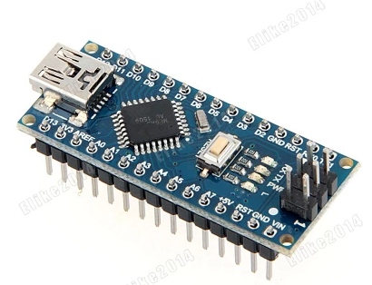
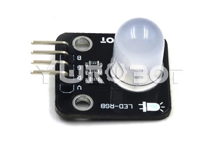
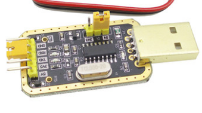
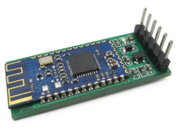
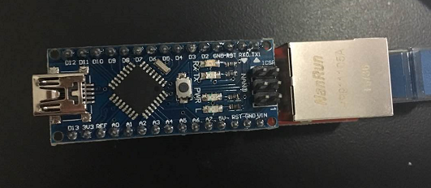
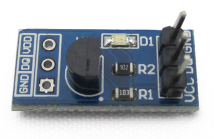

# 单片机开发——Arduino
## 内容介绍
单片机可以说是物联网开发的基础了，市面上形形色色的智能设备，都是通过在单片机上编写程序开发出来的。这一讲将介绍一款开源电子原型平台——arduino，它的开发超级简单，相信读者肯定可以迅速的掌握它。这个教程是一个物联网教程，我是以打算案例的方式进行讲解，这里的‘物’(单片机)连接的网络目前是两个，一个是蓝牙，可以在近距离进行控制；第二个是以太网，可以在任何有网的情况下对arduino的控制。我们将在这章学习Arduino基本的IO操作、PWM、串口的操作，让读者对硬件开发有个大概的认识。

## 材料准备
在开始之前, 请准备好以下硬件材料(最简单的方式是从淘宝购买)：  
### 1、arduino nano 开发板一块  
我们的主要开发板，比arduino uno模块更加小巧。 

### 2、RGB-LED模块
是一款LED灯，拥有三个管脚，共阳极或者共阴极,可以显现出各种RGB颜色。 

### 3、USB转TTL模块
主要用在串口调试方面，常用的USB转TTL模块的驱动芯片有PL2303、CH340等。 

### 4、蓝牙4.0模块(CC2541或CC2540)
蓝牙4.0，也叫BLE，是低功耗的蓝牙。可以连接到andorid4.0以上以及iphone4s以上的设备。这里使用的是TI公司的CC2541或者CC2540。 

### 5、Nano ENC28J60 Ethernet shield网络模块
这是一款专门为nano开发板设计的以太网模块，可以连接网线，让arduino上网。(所以这里还需要一根网线和路由器) 

### 6、DS18B20模块
温度传感器。 

### 7、杜邦线若干、烙铁、焊锡、钳子等工具
基本配件，就不多说了。

## 链接
- [目录](directory.md)  
- 上一节：[前言](preface.md)
- 下一节：[Arduino开发环境搭建](1.1.md)
