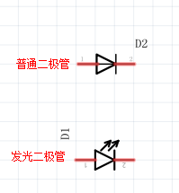
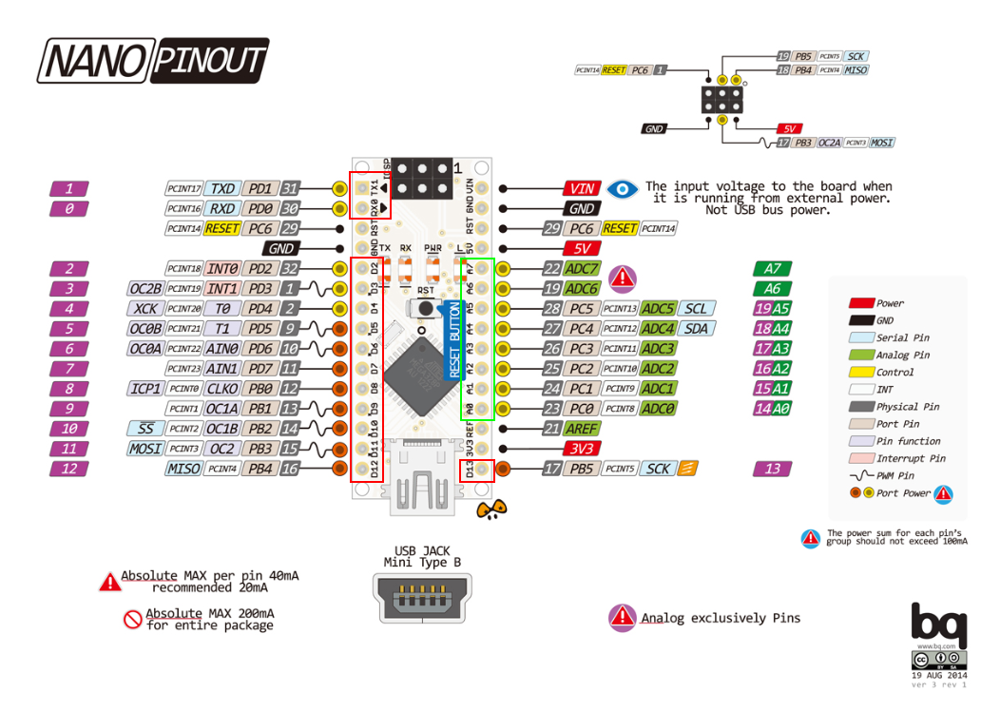
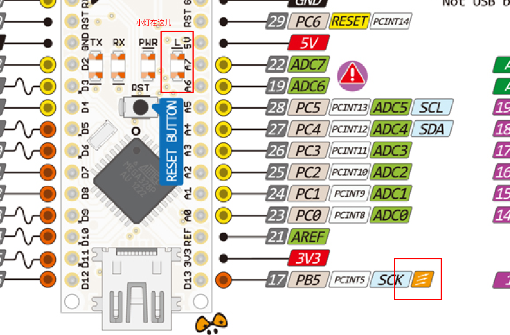
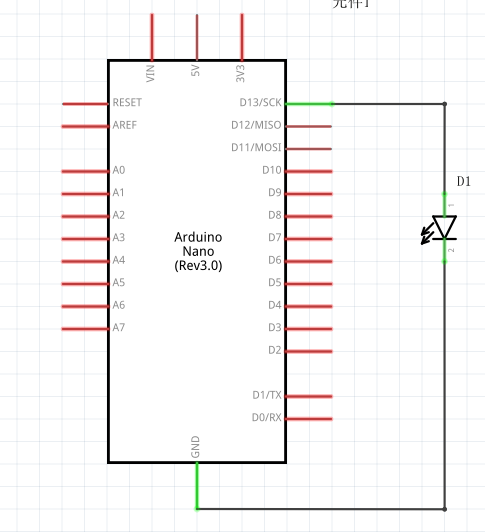

# 点亮一个Led
## LED点亮原理
一个LED(Light Emitting Diode)灯其实就是一个二极管，，以下是它的原理图，和普通二极管相比，只是多了两个斜箭头。  
  
发光二极管当它导通的时候，也就是阴极给一个低电平，阳极给一个高电平，LED就会亮起来了。
## Nano管脚说明
Arduino Nano是一款小巧、全面、基于ATmega328芯片的开发板，以下是它的管脚图。
  
Nano上有14个数字引脚(上图红色)，以及8个模拟引脚(上图绿色)。(在本教程中不会涉及模拟引脚)。关于Nano其他外设信息，读者可以参考http://www.arduino.org.cn/products/boards/4-arduino-boards/arduino-nano ，里面十分详细。
## 点亮LED灯
了解完基础之后，我们该开始编程了，首先是LED，nano开发板内置了一个LED灯，读者可以看上面管脚图的D13引脚，有个发光的图案，这其实就是Arduino内置的LED。  
  
它内部的原理图如下图。  
  
所以要点亮这个灯，就要让D13管脚输出一个高电平，同样，要熄灭它让D13输出一个低电平就可以。我们这一节的最终目的就是点亮它，并让他亮灭交替。代码的逻辑很简单，就是让D13，一会儿输出高电平，一会儿输出低电平。我们先看一下代码。
``` arduino
int pin = 13;               //定义管脚为D13

void setup() {
  pinMode(pin, OUTPUT);     //设置D13管脚模式为输出
}

void loop() {
  digitalWrite(pin, HIGH);  //在D13管脚输出高电平
  delay(1000);              //MCU休眠1000ms
  digitalWrite(pin, LOW);   //在D13管脚输出低电平
  delay(1000);              //MCU休眠1000ms
}
```
首先说一下setup()和loop()函数，其实可以想象一个隐藏的main函数，这个main函数是这样的：
``` c
int main()
{
   setup();
   while(1){
     loop();
   }
   return 0;
}
```
也就是说，setup()是做基本的初始化操作，而loop()则是无限循环，当函数return的时候，单片机的CPU也就不工作了。<br><br>
接下来说一下pinMode，pinMode用于设置管脚的模式，第一个参数是引脚名，第二个参数是OUTPUT或INPUT，我们这里需要在D13输出一个高电平或低电平，所以选择的参数自然是OUTPUT。<br><br>
接下来就是loop函数中的digitalWrite，和delay了。digitalWrite用于对数字引脚输出高低电平，delay就是让单片机的CPU睡眠。比如说这里，先输出高电平，睡眠一秒，在输出低电平，睡眠一秒，就可以实现LED灯一亮一灭的效果了。上传一下试试吧。
## 链接
- [目录](directory.md)  
- 上一节：[Arduino开发环境搭建](1.1.md)  
- 下一节：[PWM操作](1.3.md)
