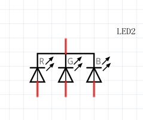
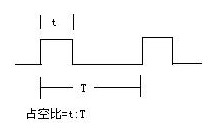

# PWM操作
我们这一节将使用RGB-LED做一个七彩的呼吸灯的案例，请读者准备好硬件材料。
## RGB-LED原理
RGB-LED灯一共有四个引脚。首先先看一下，RGB-LED的原理图。<br>
<br><br>

我们可以看到，所谓RGB-LED，其实就是三个LED组装到一起，把所有的阴极或者阳极连在一起，本质上还是LED。（我这里是共阴的，也就是阴极都连在一起）。<br><br>
关于RGB，我们能看到的所有颜色，都可以由RGB这三个颜色组成，比如说R+G可以形成黄色，R+B可以形成紫色，等等...<br><br>

接下来我们先来写一个简单地程序，来不断地显示红、黄、绿、青、蓝、紫几种颜色，来认识一下RGB-LED的效果。<br><br>

原理图：<br>
<br><br>

面包板图：<br>
<br><br>

按照上图的连线，用双母头的杜邦线把管脚接好(如果是共阳的RGB-LED，则没有GND极，只要把VCC接到电源就好了)，上传运行以下代码。
``` arduino
int rPin = 3;   //D3接R管脚
int gPin = 5;   //D5接G管脚
int bPin = 6;   //D6接B管脚

/**
 * 根据r,g,b的值给相应管脚输出高低电平,并睡眠1s
 */
void outputColorAndDelay(int r, int g, int b){
  digitalWrite(rPin, r ? HIGH : LOW); //根据r的值在D3输出高低电平
  digitalWrite(gPin, g ? HIGH : LOW); //根据g的值在D5输出高低电平
  digitalWrite(bPin, b ? HIGH : LOW); //根据b的值在D6输出高低电平
  delay(1000);                        //MCU休眠1000ms
}

void setup() {
  pinMode(rPin, OUTPUT);
  pinMode(gPin, OUTPUT);
  pinMode(bPin, OUTPUT);
}

void loop() {
  outputColorAndDelay(1, 0, 0); //输出红色
  outputColorAndDelay(1, 1, 0); //输出黄色
  outputColorAndDelay(0, 1, 0); //输出绿色
  outputColorAndDelay(0, 1, 1); //输出青色
  outputColorAndDelay(0, 0, 1); //输出蓝色
  outputColorAndDelay(1, 0, 1); //输出紫色
}
```
如果能看到红、黄、绿、青、蓝、紫几种颜色交替变换的效果，就说明成功了。

## PWM原理
PWM的英文全称是"Pulse Width Modulation"，中文解释是“脉冲宽度调制”。以我的理解，就是可调占空比(duty)的方波。<br><br>

如果不理解占空比，先看看百度百科上是怎么解释的：<br><br>

> 占空比是指脉冲信号的通电时间与通电周期之比。在一串理想的脉冲周期序列中（如方波），正脉冲的持续时间与脉冲总周期的比值。

具体如下图：<br>
<br><br>

设置PWM时，首先需要设置上图中的T，也就是整个周期。一旦设置，一般这个T就先不改动了。之后，我们可以在任何时候设置t，从而实现可调占空比。

## 呼吸灯案例
首先说一下什么叫呼吸灯，具体来说就是，拿一个颜色的灯举例，灯的颜色逐渐变暗，然后再逐渐变亮，一明一灭，就像灯在呼吸似得。<br><br>

实现方法：主要是利用人眼睛的分辨能力没有那么强，在一个足够短的时间（比如说1毫秒）内，如果输出一个指定占空比的方波时，占空比就相当于灯的亮度。因为占空比越大，高电平的时间也就越长，平均功率也就越大，自然更亮一些。所以，PWM可以实现调整灯的亮度的效果。（除此之外，舵机等也是通过PWM来调整角度的，有兴趣可以买一个舵机玩儿玩儿。）<br><br>

我们先可以尝试模拟一下PWM波，把1毫秒分成一百份（每一份都是在loop函数占用10微秒），在执行前50个loop中输出高电平，在执行后50个loop中输出低电平，代码如下。
``` arduino
int pin = 3;    //D3管脚,接R管脚
int T = 100;
int t = 50;    //占空比= t:T
int count = 0;  //计数器

void setup() {
  pinMode(pin, OUTPUT);
}

void loop() {
  if(count < t) {
    digitalWrite(pin, HIGH);
  }else{
    digitalWrite(pin, LOW);
  }
  count++;
  if(count >= T){
    count = 0;
  }
  delayMicroseconds(10);//睡眠10微秒
}
```
编译上传以上脚本，我们可以看到，灯的颜色没有变化。但是相比之前只输出digitalWrite(pin, HIGH)的亮度有所下降。这里我们相当于在D3管脚模拟了一个占空比为百分之50，周期T为1毫秒的方波。读者可以尝试改变小写t变量的值，来观察灯亮度的变化。<br><br>

其实输出PWM波arduino已经给了我们实现，我们使用arduino的analogWrite函数就可以。
``` arduino
int pin = 3;
int t = 128;
// int T = 255 隐藏大T为255, 占空比= t:T

void setup() {
  pinMode(pin, OUTPUT);
  analogWrite(pin, t);
}

void loop() {}
```
analogWrite其实相当于输出PWM的信号频率约为490赫兹，并且它的小t值是在0-255之间。<br><br>

另外，需要说明的一点是，并不是所有数字管脚都可以使用analogWrite函数的，只有 3, 5, 6, 9, 10, 和 11可以使用，具体参考：http://www.arduino.org.cn/products/boards/4-arduino-boards/arduino-nano 。<br>
<br><br>

了解了基本的PWM，接下来要进行呼吸灯的案例了，我们只需要一个LED灯。我们假定最开始是灭的，然后缓缓变亮。然后当达到最亮时候，则开始缓缓变暗。我们用flag来控制是否逐渐变亮还是逐渐变暗，每5毫秒亮度有一点变化，代码如下：
``` arduino
int pin = 3;
int flag = 0; //flag = 0，暗变亮，flag=1，亮变暗
int duty = 0; //初始化为暗

void setup() {
  // put your setup code here, to run once:
  pinMode(pin, OUTPUT);
}

void loop() {
  analogWrite(pin, duty);
  delay(5);
  if(flag == 0){
    duty++;
    if(duty >= 255) flag = 1;
  }else{
    duty--;
    if(duty <= 0) flag = 0;
  }
}

```
## 七彩呼吸灯案例
这个案例是接着上一个案例之上创建的，我们要实现一个效果:从红色逐渐过渡到黄色(中间经过橙色)，从黄色逐渐过渡到绿色...，最后从紫色再逐渐过渡回到红色，形成所谓七彩的效果。<br><br>

七彩呼吸灯的代码和呼吸灯的案例类似，主要说一下七彩的原理。<br><br>

- 最开始，从红变黄，是红色的duty为满格，绿色的duty值从0开始增加到255，蓝色的duty值为0；<br>
- 黄变绿，红色的duty逐渐减小到0；<br>
- 绿变青，蓝色的duty逐渐增加到255；<br>
- 青变蓝，绿色的duty逐渐减小到0；<br>
- 蓝变紫，红色的duty逐渐增加到255；<br>
- 紫变红，蓝色的duty逐渐减小到0。<br>

变色的过程就是这样，直接上代码了。
``` arduino
int rPin = 3;
int gPin = 5;
int bPin = 6;   
int rDuty = 255;
int gDuty = 0;
int bDuty = 0 ;
//flag = 0,红->黄
//     = 1,黄->绿
//     = 2,绿->青
//     = 3,青->蓝
//     = 4,蓝->紫
//     = 5,紫->红
int flag = 0;

void setup() {
  pinMode(rPin, OUTPUT);
  pinMode(gPin, OUTPUT);
  pinMode(bPin, OUTPUT);
}

void loop() {
  analogWrite(rPin, rDuty);
  analogWrite(gPin, gDuty);
  analogWrite(bPin, bDuty);
  delay(5);
  switch(flag){
    case 0:       
      gDuty++;
      if(gDuty >= 255) flag++;
      break;
    case 1:
      rDuty--;
      if(rDuty <= 0) flag++;
      break;
    case 2:
      bDuty++;
      if(bDuty >= 255) flag++;
      break;
    case 3:       
      gDuty--;
      if(gDuty <= 0) flag++;
      break;
    case 4:
      rDuty++;
      if(rDuty >= 255) flag++;
      break;
    case 5:
      bDuty--;
      if(bDuty <= 0) flag = 0;
      break;
  }
}
```

## 链接
- [目录](directory.md)  
- 上一节：[点亮一个Led](1.2.md)  
- 下一节：[UART的使用](1.4.md)
