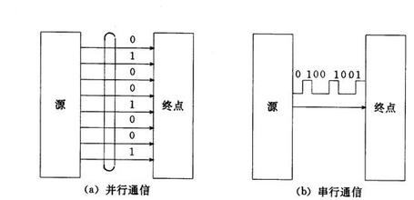
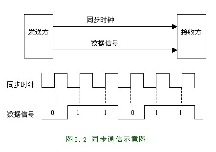

# UART的使用

## UART的介绍
这节课来介绍UART，也就是串口通信。先看一下百度百科上对UART的定义。
> UART是一种通用串行数据总线，用于异步通信。该总线双向通信，可以实现全双工传输和接收。

这里，我主要提取三个关键词来分别解释，第一个“串行”，第二个“异步”，第三个“全双工”。 
### 串行与并行
先来说说什么是串行和并行总线。 
以下这样图可以很好的解释。串行也就是只有一根线，一个周期传送1个bit，8个周期传送1个byte，速度传送较慢。并行通信采用多根总线，比如说8根总线的话，一个周期就可以传送一个byte，不过并行通信的缺点是传输距离短。
     

### 异步通信与同步通信
再来说说什么是异步通信与同步通信。 
同步通信就是需要发送方和接收方有一个时钟，在同一个时钟下来进行需要数据的传输。而异步通信发送方和接收方有着自己的时钟，通过起始位和停止位来判断是否有数据，为了保证数据传输的可靠性，还会有一些校验位，用于判断数据是否有效，如奇偶校验等，读者可以自行百度了解。
同步通信示意图：（图是百度上找的） 
   
异步通信示意图：（图中的0代表起始位，1代表停止位。） 
   
另外，对于异步通信来说，还有一个不得不说的，就是波特率（每秒钟传送字符的速率），虽然异步通信不要求时钟严格一致。但是，发送端和接收端的时钟的周期也应该是一样的，这样才能保证接收端有效的对接受的数据进行判断。 
常见的波特率有：300、600、1200、2400、4800、9600、19200、38400、43000、56000、57600、115200。
### 单工、半双工和全双工
最后再看看什么是单工、半双工和全双工。 
其实概念很简单，通俗的来讲，单工就是只有一方可以发送数据，比如打印机，只接受数据。半双工就是两方都可以发送数据，但不能同时发送数据，比如对讲机，只能同时听一个人说话。而全双工则是两方可以同时传送数据，比如打电话，对方说着说着有那块说的不对了，你给他打断了。
这张示意图可以很好的解释： 
   

## UART的使用

### 串口发送数据

### 串口接收数据

## 链接
- [目录](directory.md)  
- 上一节：[PWM操作](1.3.md)  
- 下一节：[上位机开发——.Net](2.0.md)
