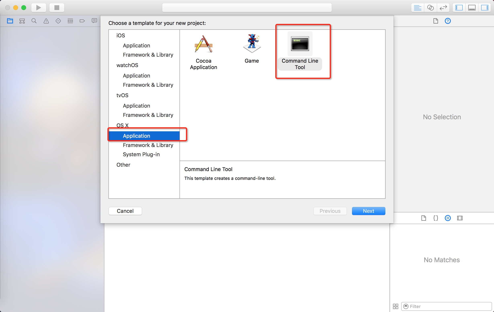
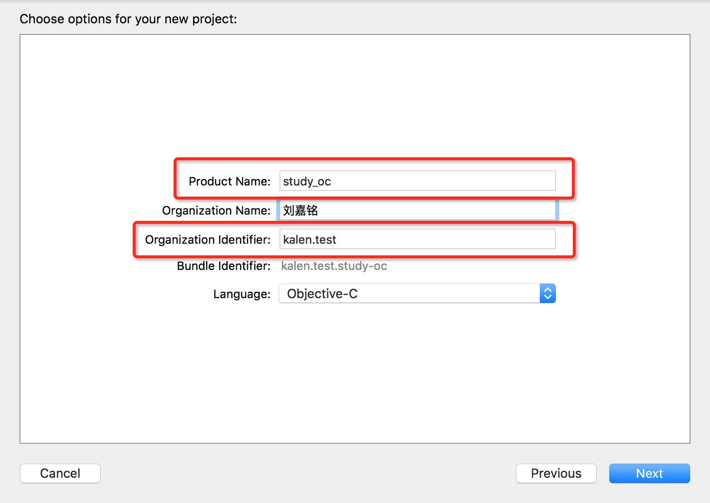
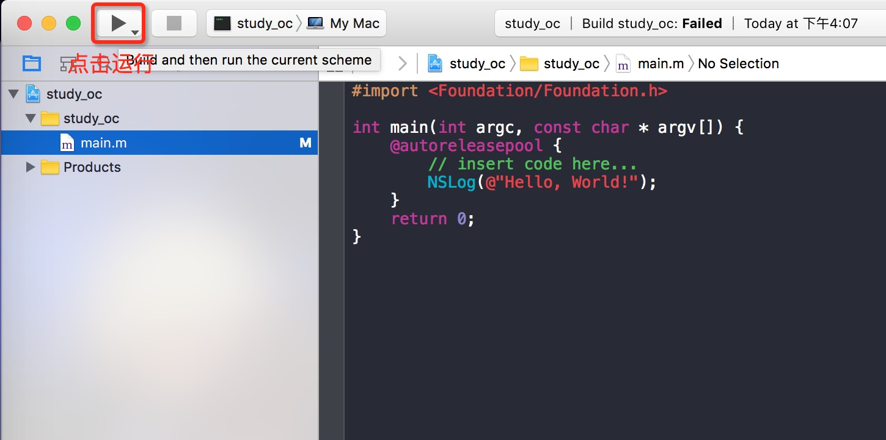

# Objective-C语言快速入门

## OC初探
Objective-C是一门面向对象的语言，是开发iOS的一门编程语言。它和C++一样都是对C语言的扩充，可以简称为：OC。OC对C语言的语法完全兼容，在C语言上添加了面向对象的特性。<br><br>

下面，我们打开Xcode，选择“Create a new Xcode Project”。<br>
<br><br>

选择创建工程之后，我们会进入到一个新的界面，来选择创建项目的类型。这里一共显示出了目前苹果公司使用的四种操作系统。iOS：iPhone、iPad设备的操作系统，是我们的重点；watchOS：苹果表的操作系统；tvOS：苹果电视的操作系统；OS X：苹果笔记本的操作系统。我们将首先像最开始学习C语言的时候一样，先创建一个CLI程序，所以选择“OS X”下的Application中的“Command Line Tool”。<br>
<br><br>

接下来，我们需要输入项目名称以及项目的组织名，我这里把工程名设为“study_oc”，组织名和工程名将构成包名，用来唯一区别我们的应用，我这里把它设为“kalen.test”。<br>
<br><br>

点击“Next”后，会弹出保存的地点，这个可以根据读者自己来定。工程创建完成后，我们将看到study_oc文件夹下有一个“main.m”文件，OC的文件和c以及c++一样，包含头文件和源文件，头文件是以“.h”结尾，源文件以“.m”结尾。<br><br>

打开main.m文件，我们可以看到代码如下：
``` objc
#import <Foundation/Foundation.h>

int main(int argc, const char * argv[]) {
    @autoreleasepool {
        // insert code here...
        NSLog(@"Hello, World!");
    }
    return 0;
}
```
这里main函数的定义和C语言都一样。在头文件上，它引入了“Foundation/Foundation.h”，Foundation是苹果的标准库，还有个库叫做UIKit，它是开发UI的标准库。这里比较奇怪的就是“@autoreleasepool”，这是OC负责内存管理的。由于内存管理牵扯较多，在本教程中，不会涉及到这部分的内容，所以读者有兴趣的话可以自行查阅资料。<br><br>

跳过了库的引用以及内存管理后，剩下的只有一条语句了，就是NSLog。我们现在点击左上角运行图标运行一下。<br>
<br><br>

可以看到在Xcode下方的控制台中打印出了“Hello World”，而且带着时间前缀。<br>
<br><br>

在NSLog中的参数是@"Hello, World!"，而非"Hello, World!"。前者代表了NSString，而后者代表了C语言中的字符串。我们可以看以下代码来体会一下。
``` objc
#import <Foundation/Foundation.h>

int main(int argc, const char * argv[]) {
    @autoreleasepool {
        NSString* nsstr = @"Hello World!";  //OC中的字符串
        int int_val = 10;                   //整型
        char* c_str = "Hello World!";       //C语言中的字符串
        NSLog(@"\nThe NSString is: %@;\nThe int val is: %d;\nThe C String is: %s", nsstr, int_val, c_str);
    }
    return 0;
}
```
## 创建一个“类”
简单接触了OC之后，我们开始学习面向对象的知识，首先我们先创建一个类。右键项目文件夹，选择“New File”。<br>
<br><br>


## “类”的方法

## “类”的属性

## 数组的使用

## 链接
- [目录](directory.md)  
- 上一节：[移动开发——iOS](4.0.md)  
- 下一节：[基本控件使用](4.2.md)
