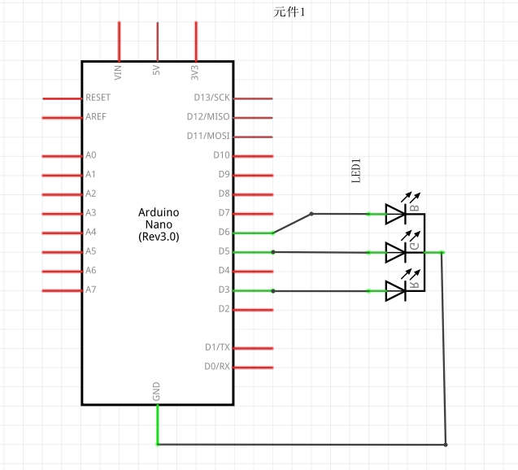
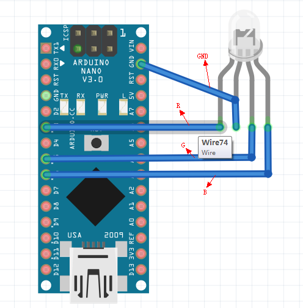
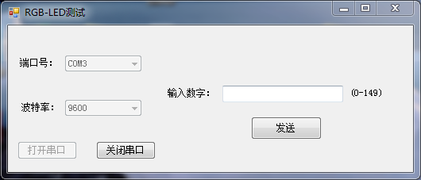

# 用串口控制RGB灯颜色

## 硬件连接
本讲的硬件连接与1.3节的一样，接线图如下。<br>
原理图：<br>
<br>
面包板图：<br>
<br>

## 通信协议设计
接下来，我们开始进行通信协议的设计。在1.4节使用的串口通信中，我们可以Serial.read()获取一个8字节的数据，也就是0-255(unsigned char)。为了简便，使用单字节控制RGB-LED的颜色。

- 接收数据：0-49，控制R管脚
- 接收数据：50-99，控制G管脚
- 接收数据：100-149，控制B管脚

由于PWM的一个周期被分为255份，这里每个控制位都是50位，所以我们降低一下精度标准，把接收到的信号乘5，扩充到0-250。完成的代码如下。
``` arduino
unsigned char temp;
int rPin = 3;
int gPin = 5;
int bPin = 6;   


void setup() {
  Serial.begin(9600);
  pinMode(rPin, OUTPUT);
  pinMode(gPin, OUTPUT);
  pinMode(bPin, OUTPUT);
  analogWrite(rPin, 0);
  analogWrite(gPin, 0);
  analogWrite(bPin, 0);
}

void loop() {
  while(Serial.available()){ //如果电脑给单片机发送了数据,就把同样的数据发送回去.
    temp = Serial.read();
    if(temp < 50){
      analogWrite(rPin, temp * 5);
    }else if(temp < 100){
      analogWrite(gPin, (temp - 50) * 5);
    }else if(temp < 150){
      analogWrite(bPin, (temp - 100) * 5);
    }
  }
  delay(1);
}
```
## 利用串口助手设置颜色
接下来我们开始用串口测试我们的LED，读者可以打开文件目录下的 code\6.1\RGBLedSerialPortTest文件夹，用VS2013打开并运行，可以看到以下界面。<br>
<br>
其实就是根据2.2节的程序修改过来的，本节只需要发送一个数字就好了，对2.2节程序进行了稍微的修改，这里不细说了，有兴趣读者可以自行阅读源码。<br><br>
我们开始测试我们的单片机程序，<br>

- 首先输入49，观察LED是否为红色，输入0，看红灯是否熄灭。
- 首先输入99，观察LED是否为绿色，输入50，看绿灯是否熄灭。
- 首先输入149，观察LED是否为蓝色，输入100，看蓝灯是否熄灭。

如果看到以上现象，就说明通过串口传输数据成功了。(读者也可以进行其他测试，比如说：同时输入49、99、149，看灯是否为白色，以及等等)

## 链接
- [目录](directory.md)  
- 上一节：[蓝牙开发](6.0.md)  
- 下一节：[用上位机控制LED的亮灭](6.2.md)
