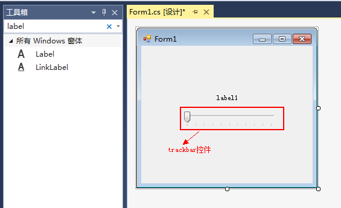
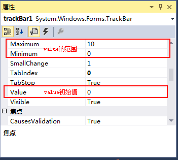
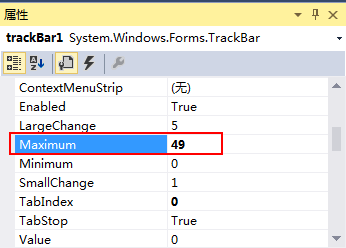
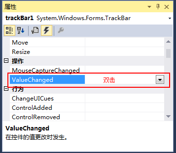
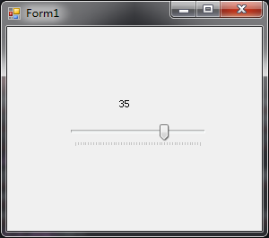
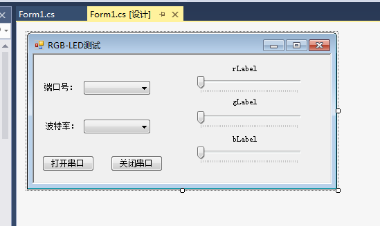
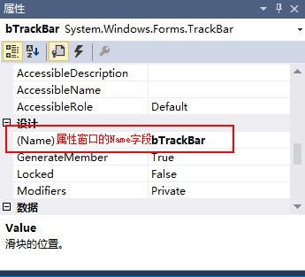
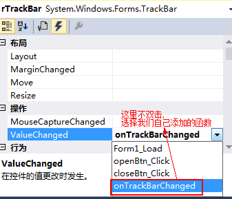

# 用上位机控制RGB灯颜色

## 利用SerialPort控件发送单个字符
我们上一节利用上位机程序，发送单个字符给了单片机，读者可以打开code\6.1\RGBLedSerialPortTest\SerialPortTool\Form1.cs，里面的发送部分代理函数如下：
``` arduino
private void sendBtn_Click(object sender, EventArgs e)
{
    try
    {
        int val = int.Parse(sendTBox.Text);
        if (val >= 150 || val < 0)
        {
            MessageBox.Show("请输入0-149之间的数字");
            return;
        }
        byte[] data = new byte[1]{(byte)val};
        serialPort1.Write(data, 0, 1);
    }
    catch (Exception ex)
    {
        MessageBox.Show(ex.Message);
    }
}
```
和2.2节编写串口助手的时候用的serialPort1.WriteLine相比，前者是使用一个字符串，而这里则使用一个byte数组，第二个参数代表传输从0开始，第三个参数代表传输一个字节。
## trackbar控件的使用
了解完如何用串口发送单个字符后，我们开始学习一个新的控件：trackbar。<br><br>
这一节，我们将用三个trackbar来分别控制R、G、B三个管脚的灰度值，达到控制小灯颜色以及亮度的目的。<br><br>
首先，我们先了解一下trackbar的用法吧，新建一个Windows窗体应用程序，起名为：TrackbarTest。然后从工具箱里拖一个TrackBar和label过去<br><br>
<br>
由上图，trackbar就是一个滚动条。对于trackbar，有一个比较重要的属性叫做Value，就是对应trackbar滑动的位置。以及一个比较重要的事件ValueChanged，当用户进行拖动，就会调用绑定的ValueChanged方法。<br><br>
我们先来看一下Value，首先查看trackbar的属性，这里有一个Maximum和Minimum，用来设置滚动条滚动的范围。以及Value属性，就是设置Value的初始值。<br>
<br>
在上一节，我们规定了每个颜色占用50个字符(0-49, 50-99, 100-149)，我们这里把Maximum设置为49。<br><br>
<br>
看完了Value之后，我们开始看看ValueChanged，点击属性窗口的小闪电，进入trackbar事件列表，我们双击ValueChanged，<br>
<br>
添加以下代码：
``` csharp
private void trackBar1_ValueChanged(object sender, EventArgs e)
{
    label1.Text = trackBar1.Value + "";
}
```
然后，我们运行程序，拖动trackbar，就可以看到以下的效果了。<br>
<br>
trackbar就是如此简单。
## RGB上位机编写
学习了trackbar的使用，我们就可以来编写我们的RGB小灯上位机了，我们可以使用之前的2.2节的SerialPortTool的代码进行修改(这部分的代码见:code\6.2\RGBLedController)，把发送区的界面都删除掉，然后添加三个trackbar以及label，界面如下：<br>
<br>
这里，我们为新添加的三个label和三个trackbar分别命名为rLabel、gLabel、bLabel，rTrackBar，gTrackBar，bTrackBar。<br>
<br>
双击一下窗体，进入Form1的load方法，
``` csharp
private void Form1_Load(object sender, EventArgs e)
{
    closeBtn.Enabled = false; //没有打开串口时，无法点击关闭串口

    //初始化端口号
    for (int i = 1; i <= 20; i++)
    {
        portComboBox.Items.Add("COM" + i);
    }
    portComboBox.SelectedIndex = 0;

    //初始化波特率
    string[] baudRates = {"300","600","1200","2400",
                             "4800","9600","19200",
                             "38400","43000","56000",
                             "57600","115200" };
    foreach (string baudRate in baudRates)
    {
        baudRateComboBox.Items.Add(baudRate);
    }
    baudRateComboBox.SelectedIndex = 5;

    /************新增代码*********/
    rTrackBar.Enabled = false;
    gTrackBar.Enabled = false;
    bTrackBar.Enabled = false;

    rLabel.Text = "R:0";
    gLabel.Text = "G:0";
    bLabel.Text = "B:0";
    /****************************/
}
```
这里相比2.2节的程序，添加了一些初始化的部分。接下来，我们创建一个代理方法，用来处理三个trackbar的ValueChanged事件。<br>
``` csharp
private void onTrackBarChanged(object sender, EventArgs e)
{
    byte[] data = new byte[3] { (byte)rTrackBar.Value, (byte)(gTrackBar.Value+50), (byte)(bTrackBar.Value+100) };
    serialPort1.Write(data, 0, 3);
    rLabel.Text = "R:" + rTrackBar.Value;
    gLabel.Text = "G:" + gTrackBar.Value;
    bLabel.Text = "B:" + bTrackBar.Value;
}
```
这是我们自己添加的代理方法，有两个参数必须有一个是sender，还有就是EventArgs。在这里我们使用serialPort1.Write发送三个字节的字符。<br><br>
添加完这个方法之后，就可以在trackbar的ValueChanged事件里添加这个方法了。<br>
<br>
当然，你也可以在Form1_Load方法中添加这个代理，(这里使用到了多播委托的知识)
``` csharp
rTrackBar.ValueChanged += onTrackBarChanged;
gTrackBar.ValueChanged += onTrackBarChanged;
bTrackBar.ValueChanged += onTrackBarChanged;
```
相比2.2节的改动就这么多，我们运行程序，打开串口，拖动trackbar，看一下效果。如果拖动trackbar能看到，小灯的颜色逐渐变化，就说明成功了。<br><br>
用winform写一个电脑上的上位机程序就是这么简单。下一节，我们将进入安卓部分，开始学习蓝牙4.0，为做一个安卓版的RGB小灯控制器做准备。

## 链接
- [目录](directory.md)  
- 上一节：[用串口控制RGB灯颜色](6.1.md)  
- 下一节：[安卓——蓝牙4.0例程源码阅读](6.3.md)
