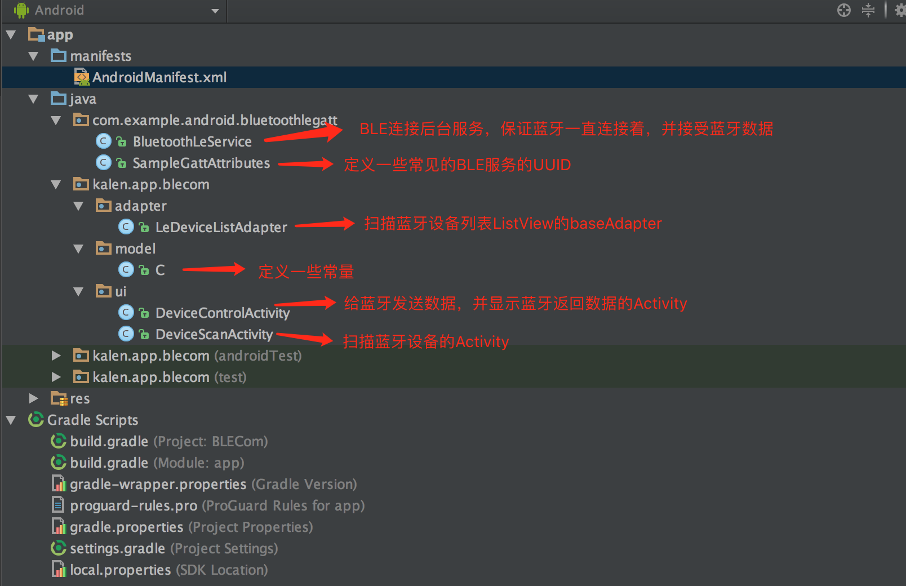
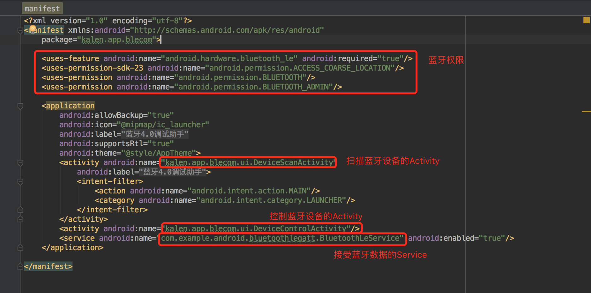

# 安卓——蓝牙4.0例程源码阅读

## 代码结构
首先我们导入本章节的代码到eclipse中，看一下代码的结构。 
  

## AndroidManifest.xml
我们打开manifest文件，可以看到这里包含了一些权限，以及两个Activity和一个Service。 
  

可以看到这里需要蓝牙的控制权限，并且要求手机支持蓝牙4.0，模拟器无法使用蓝牙4.0，所以必须在真机下进行测试，关于如何进行真机测试可以查阅百度或查看[附录B](appendixB)的内容。  

除此之外，我们的最小sdk要求版本是18，也就是安卓4.3，你需要确保你的手机操作系统在安卓4.3版本以上。  

接下来，我们可以看到DeviceScanActivity是应用程序的入口，也就是扫描设备的Activity；DeviceControlActivity，控制发送接收蓝牙数据的Activity；以及BluetoothLeService，用于接收蓝牙数据的Service。  

我们将要在下面仔细研究两个Activity的代码，BluetoothLeService的代码读者有兴趣可以自己查看。

## DeviceScanActivity分析

## DeviceControlActivity分析

## 链接
- [目录](directory.md)  
- 上一节：[蓝牙4.0简单介绍](6.3.md)  
- 下一节：[安卓——用手机控制RGB灯颜色](6.5.md)
