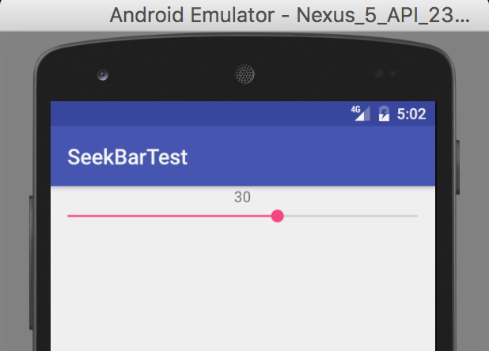

# 安卓——用手机控制RGB灯颜色

## SeekBar控件的使用
为了实现6.2节相类似的安卓app，我们首先先来再学习一个控件：SeekBar。首先创建一个名为SeekBarTest的工程。<br><br>

接下来，我们修改activity_main.xml，如下:
``` xml
<LinearLayout xmlns:android="http://schemas.android.com/apk/res/android"
    xmlns:tools="http://schemas.android.com/tools"
    android:layout_width="match_parent"
    android:layout_height="match_parent"
    android:orientation="vertical"
    tools:context=".MainActivity" >

    <TextView
        android:id="@+id/seekbar_value"
        android:layout_width="match_parent"
        android:layout_height="wrap_content"
        android:gravity="center"
        android:text="@string/hello_world" />

    <SeekBar
        android:max="50"
        android:id="@+id/seekbar"
        android:layout_width="match_parent"
        android:layout_height="wrap_content"/>

</LinearLayout>
```
这里使用了SeekBar控件，并把它最大值设为100，也就是它的范围是0-50；并使用一个TextView来显示SeekBar的位置。<br><br>

接着，我们像之前一样，通过findViewById找到相应的View。
``` java
  TextView textView;
	SeekBar seekBar;

	@Override
	protected void onCreate(Bundle savedInstanceState) {
		super.onCreate(savedInstanceState);
		setContentView(R.layout.activity_main);

		textView = (TextView) findViewById(R.id.seekbar_value);
		seekBar = (SeekBar) findViewById(R.id.seekbar);
	}
```
seekBar有一个和setOnClickListener很相似的方法叫做setOnSeekBarChangeListener，很显然这是监控seekBar的变化的。在OnSeekBarChangeListener接口中，有三个方法onStartTrackingTouch，onStopTrackingTouch，onProgressChanged：开始拖动seekBar，结束拖动seekBar，seekBar的进度改变。我们这里只需要在onProgressChanged方法中添加代码就好了。
``` java
seekBar.setOnSeekBarChangeListener(new OnSeekBarChangeListener() {

	@Override
	public void onStopTrackingTouch(SeekBar arg0) {
		// TODO Auto-generated method stub

	}

	@Override
	public void onStartTrackingTouch(SeekBar arg0) {
		// TODO Auto-generated method stub

	}

	@Override
	public void onProgressChanged(SeekBar arg0, int arg1, boolean arg2) {
		//设置textView显示根据seekBar的位置
		textView.setText(arg1 + "");
	}
});
```
这里给textView设置了文本，运行程序后，拖动seekBar，我们就可以看到textView显示的进度了。<br>
<br><br>
## RGB控制安卓APP编写

### 创建例程副本

### 修改应用包名

## 链接
- [目录](directory.md)  
- 上一节：[安卓——蓝牙4.0例程源码阅读](6.4.md)  
- 下一节：[iOS——蓝牙4.0例程源码阅读]
