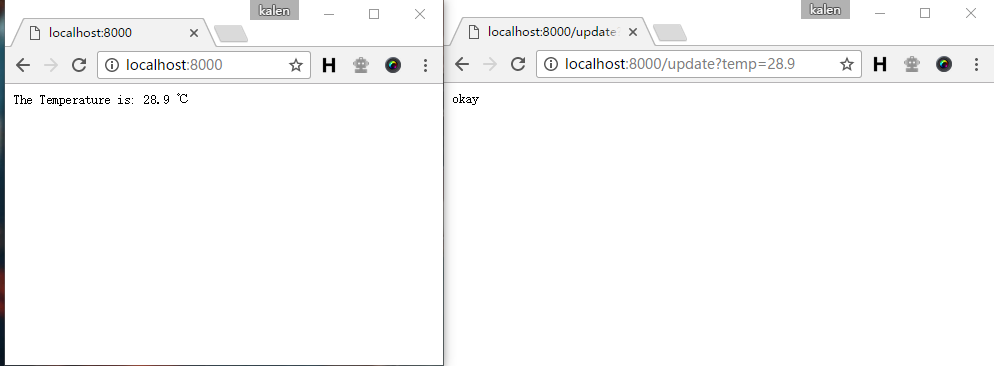
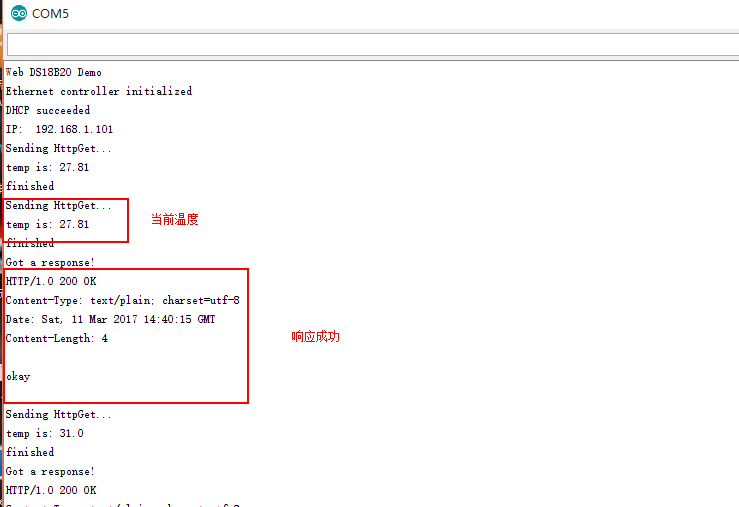
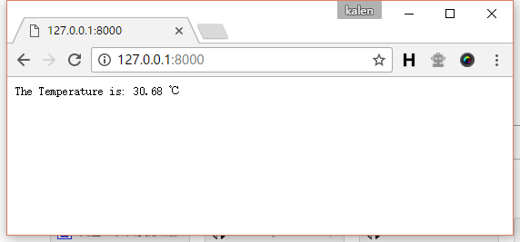
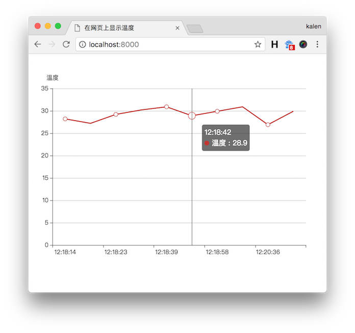

# 在网页上显示温度

## 介绍
学习了前两章之后，本章只要把前两章的内容结合起来，然后编写后台处理温度数据就好了。

## 编写后台
在这里，我们需要编写两个路由，一个路由用于处理显示温度，另一个处理更新温度，代码如下：
``` go
package main

import (
  "github.com/gin-gonic/gin"
  "fmt"
)

var (
  temp string = "0.0"
)

func main() {
    r := gin.Default()

    //显示温度
    r.GET("/", func(c *gin.Context) {
      c.String(200, fmt.Sprintf("The Temperature is: %s ℃", temp))
    })

    //更新温度
    r.GET("/update", func(c *gin.Context) {
      temp = c.DefaultQuery("temp", "0.0")
      c.String(200, "okay")
    })

    r.Run(":8000")
}
```
下面我们运行测试一下，更新一下温度，并查看温度，可以看到温度变成我们更新的温度了。<br>
<br><br>


## 结合以太网和温度传感器模块
下面，我们将7.2节的程序改一改，在sendHttpGet方法里添加获取DS18B20传感器温度代码。
``` c++
#include <EtherCard.h>
#include <OneWire.h>
#include <DallasTemperature.h>

// 将DS18B20的数据口连接到2号引脚
#define ONE_WIRE_BUS 2
// 初始连接在单总线上的单总线设备
OneWire oneWire(ONE_WIRE_BUS);
DallasTemperature sensors(&oneWire);

// ethernet interface mac address, must be unique on the LAN
static byte mymac[] = { 0x74,0x69,0x69,0x2D,0x30,0x31 };

static uint8_t server_ip[] = { 192, 168, 1, 105 };
byte Ethernet::buffer[700];
static byte session;
static uint32_t timer;
char path[100];

static void sendHttpGet () {
  Serial.println("Sending HttpGet...");

  sensors.requestTemperatures(); // 获取温度

  int temp = sensors.getTempCByIndex(0) * 100; //方便转换

  char temp_str[100];
  sprintf(temp_str, "temp is: %d.%d", temp/100, temp%100); //arduino里面没法用%f
  Serial.println(temp_str); //打印温度

  Stash::prepare(PSTR("GET /update?temp=$D.$D HTTP/1.0" "\r\n"
    "Host:" "\r\n"
    "\r\n"), temp/100, temp%100);

  session = ether.tcpSend();
  Serial.println("finished");
}

void setup () {
  Serial.println("Web DS18B20 Demo");
  Serial.begin(9600);

  sensors.begin();// 加载DS18B20库

  if (ether.begin(sizeof Ethernet::buffer, mymac, 10) == 0)
    Serial.println("Failed to access Ethernet controller");
  else
    Serial.println("Ethernet controller initialized");

  if (!ether.dhcpSetup())
    Serial.println("DHCP failed");
  else
    Serial.println("DHCP succeeded");

  ether.printIp("IP:  ", ether.myip);

  //设置服务器ip和端口号
  ether.copyIp(ether.hisip, server_ip);
  ether.hisport = 8000;
}

void loop () {
  if (millis() > timer) { // 每隔10秒发一次请求
    timer = millis() + 10000;
    //发送请求
    sendHttpGet();
  }

  //接受数据包
  ether.packetLoop(ether.packetReceive());
  const char* reply = ether.tcpReply(session);
  if (reply != 0) {
    Serial.println("Got a response!");
    Serial.println(reply);
    Serial.println();
  }
}
```

## 测试程序
最后，我们上传程序，打开串口监视器查看输出。<br>
<br><br>

可以看到，得到了"okay"的正确返回。同时，查看浏览器，看看温度是否正确。<br>
<br><br>

到这里，我们的应用就做好了，现在我们可以把代码上传到服务器上，看看能不能更新和获取温度了。<br><br>

当然如果你对后端熟悉，你可以将温度的数据存储在数据库里；如果你对前端很熟悉，可以把温度绘制成曲线显示在网页上，以下是笔者使用前端的echarts绘图库实现的一个简单的温度曲线绘制，读者感兴趣的话可以进行尝试。(代码放在了本章的server2文件夹里面)
<br>
<br><br>

## 链接
- [目录](directory.md)  
- 上一节：[ENC28J60模块的使用](7.2.md)  
- 下一节：[其它案例](8.0.md)  
